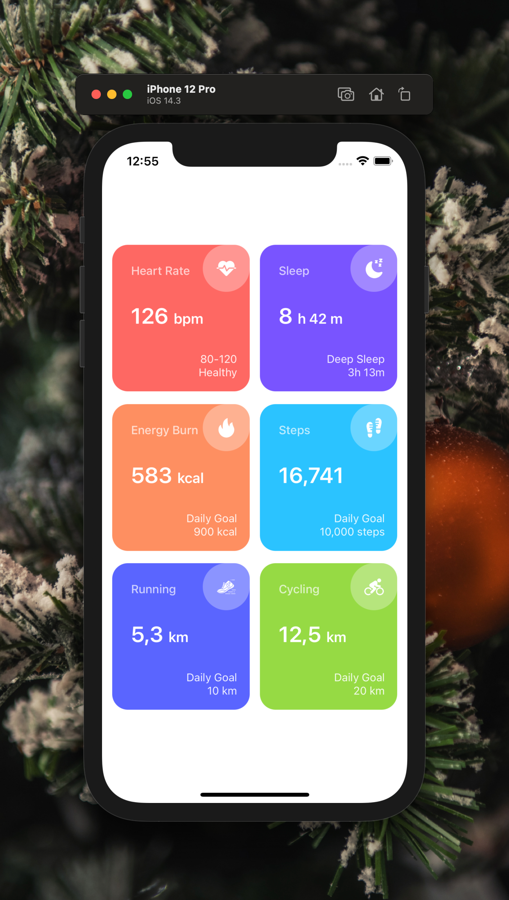

[](https://github.com/WrathChaos/react-native-colorful-card)

[](https://github.com/WrathChaos/react-native-colorful-card)

[](https://www.npmjs.com/package/react-native-colorful-card)
[](https://www.npmjs.com/package/react-native-colorful-card)

[](https://opensource.org/licenses/MIT)
[](https://github.com/prettier/prettier)

<table>
  <tr>
    <td align="center">
      
    </td>
    <td align="center">
      
    </td>
   </tr>
</table>

# Installation

Add the dependency:

```bash
npm i react-native-colorful-card
```

## Peer Dependencies

<h5><i>IMPORTANT! You need install them</i></h5>

```js
"react-native-bounceable": ">= 0.2.4"
```

# Usage

## Import

```jsx
import ColorfulCard from "react-native-colorful-card";
```

## Fundamental Usage

```jsx
<ColorfulCard
  title="Sleep"
  value="8"
  valuePostfix="h 42 m"
  footerTitle="Deep Sleep"
  footerValue="3h 13m"
  iconImageSource={require("./assets/sleep.png")}
  style={{ backgroundColor: "#7954ff" }}
  onPress={() => {}}
/>
```

## Example Project 😍

You can checkout the example project 🥰

Simply run

- `npm i`
- `react-native run-ios/android`

should work of the example project.

# Configuration - Props

## Fundamentals

| Property        |   Type   |  Default  | Description                                                        |
| --------------- | :------: | :-------: | ------------------------------------------------------------------ |
| title           |  string  | undefined | change the title string                                            |
| value           |  string  | undefined | change the value string                                            |
| valuePostfix    |  string  | undefined | change the value postfix string                                    |
| footerTitle     |  string  | undefined | change the footerTitle string                                      |
| footerValue     |  string  | undefined | change the footerValue string                                      |
| iconImageSource |  image   | undefined | set your own image source for the icon                             |
| onPress         | function | undefined | set your own logic for the button functionality when it is pressed |

## Customization (Optionals)

| Property              |    Type    | Default | Description                                                            |
| --------------------- | :--------: | :-----: | ---------------------------------------------------------------------- |
| style                 | ViewStyle  | default | set or override the style object for the main container                |
| iconImageStyle        | ImageStyle | default | set or override the image style object for the icon container          |
| titleTextStyle        | TextStyle  | default | set or override the text style object for the title text               |
| footerTextStyle       | TextStyle  | default | set or override the text style object for the footer text              |
| valueTextStyle        | TextStyle  | default | set or override the text style object for the value text               |
| valuePostfixTextStyle | TextStyle  | default | set or override the text style object for the value postfix text       |
| ImageComponent        |   Image    | default | set your own component instead of default react-native Image component |

## Future Plans

- [x] ~~LICENSE~~
- [ ] Write an article about the lib on Medium

## Author

FreakyCoder, kurayogun@gmail.com

## Credits

Heavily inspired by [WebFrontEndTips](http://webfrontendtips.blogspot.com/2020/01/how-to-design-fitness-app-ui-in-sketch.html)

## License

React Native Colorful Card is available under the MIT license. See the LICENSE file for more info.
